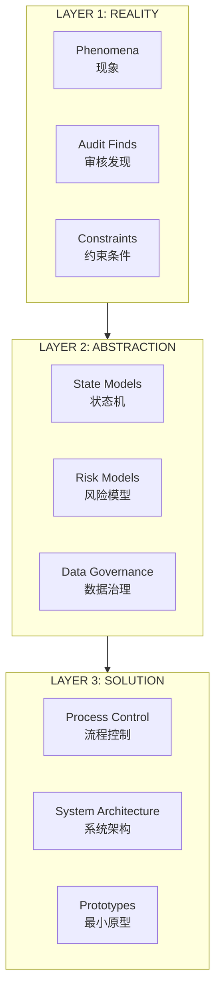
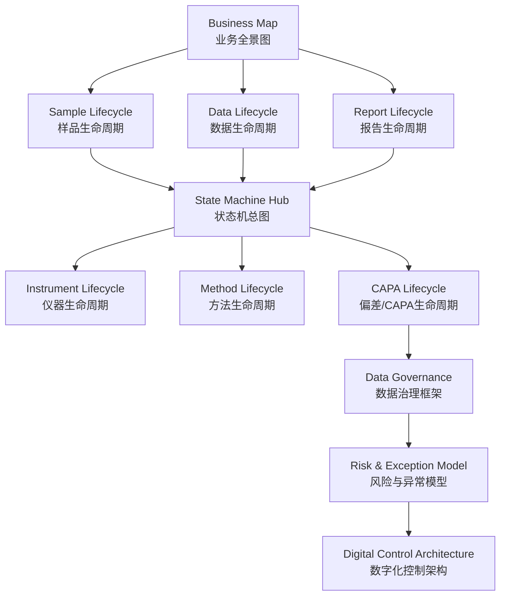
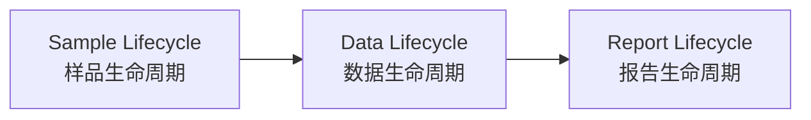
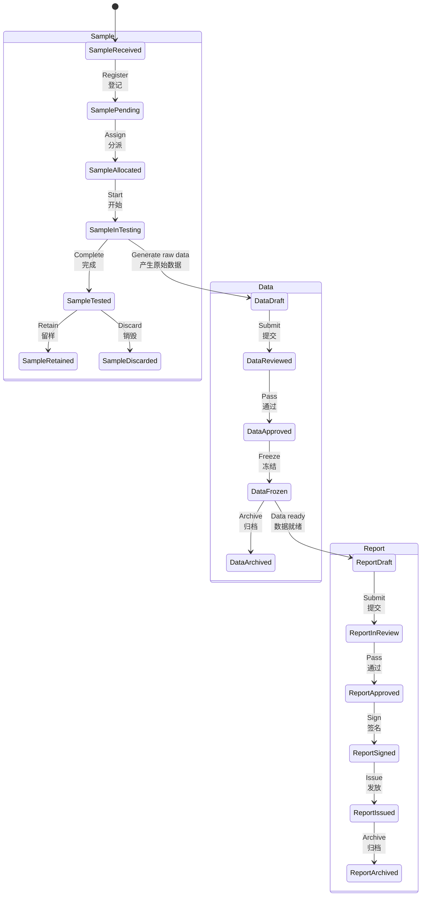

# Laboratory Digital Governance Knowledge Base

## Project Architecture | 项目架构

### Overview | 概述

This knowledge base is built on a three-layer structure:

本知识库采用三层结构：



### Module Relationships | 模块关系



### Content Layering per Module | 模块内容分层

| Layer | Name | Description | 层 | 名称 | 描述 |
|-------|------|-------------|----|------|------|
| 1 | Phenomena | What actually happens in the lab | 1 | 现象 | 实验室实际发生了什么 |
| 2 | Root Causes | Why it happens | 2 | 原因 | 为什么发生 |
| 3 | Abstract Model | The pattern behind the phenomena | 3 | 抽象模型 | 现象背后的规律 |
| 4 | Control Logic | How to control it | 4 | 控制逻辑 | 如何控制 |
| 5 | Data Structure | Fields, enums, logs | 5 | 数据结构 | 字段、枚举、日志 |
| 6 | State Machine | State transitions | 6 | 状态机 | 状态转换 |
| 7 | Minimal Solution | Lowest-cost implementation | 7 | 最小方案 | 最低成本落地方案 |

### Directory Structure | 目录结构

```text
laboratory_digital_governance/
├── README.md
├── business-map/
├── lifecycle-model/
│   ├── sample-lifecycle.md
│   ├── data-lifecycle.md
│   ├── report-lifecycle.md
│   ├── instrument-lifecycle.md
│   └── capa-lifecycle.md
├── data-governance/
├── audit-trail/
├── risk-model/
├── state-machine/
├── architecture/
├── diagrams/
├── prototypes/
└── articles/
```

---

## Glossary | 术语表

### Core Concepts | 核心概念

| Term | Definition | 术语 | 定义 |
|------|------------|------|------|
| Sample Lifecycle | The complete process from sample reception to disposal | 样品生命周期 | 从样品接收到销毁的完整过程 |
| Data Lifecycle | The complete process from data creation to archiving | 数据生命周期 | 从数据创建到归档的完整过程 |
| Report Lifecycle | The complete process from report draft to issuance | 报告生命周期 | 从报告草稿到发放的完整过程 |
| State Machine | A model defining all possible states and transitions | 状态机 | 定义所有可能状态及转换的模型 |
| Control Point | A step where checks prevent or detect errors | 控制点 | 用于预防或发现错误的关键环节 |
| Minimal Solution | Lowest-cost implementation without new systems | 最小方案 | 不依赖新系统的最低成本落地方案 |

### Sample States | 样品状态

| State | Definition | 状态 | 定义 |
|-------|------------|------|------|
| Received | Sample arrived and logged | 已接收 | 样品到达并登记 |
| Pending | Waiting for testing | 待检 | 等待检测 |
| InTesting | Currently being tested | 检测中 | 正在检测 |
| Tested | Testing complete | 已检 | 检测完成 |
| Retained | Stored for future use | 留样 | 保留以备将来使用 |
| Discarded | Disposed | 销毁 | 已处理 |
| Insufficient | Quantity below standard (exception) | 数量不足 | 样品量低于标准要求（异常） |
| RiskAccepted | Management accepted the risk | 风险已接受 | 管理层已接受该风险 |

### Data States | 数据状态

| State | Definition | 状态 | 定义 |
|-------|------------|------|------|
| Draft | Raw data created, editable | 草稿 | 原始数据已创建，可编辑 |
| Reviewed | Under review | 审核中 | 正在审核 |
| Approved | Review passed | 已批准 | 审核通过 |
| Frozen | Locked, cannot modify | 已冻结 | 锁定，不可修改 |
| Archived | Moved to long-term storage | 已归档 | 已移至长期存储 |

### Report States | 报告状态

| State | Definition | 状态 | 定义 |
|-------|------------|------|------|
| Draft | Report being written | 草稿 | 报告编写中 |
| InReview | Under review | 审核中 | 正在审核 |
| Approved | Review passed | 已批准 | 审核通过 |
| Signed | Signed by authorized signatory | 已签发 | 授权签字人已签名 |
| Issued | Delivered to customer | 已发放 | 已交付客户 |
| Corrected | Revised version after issuance | 修正版 | 发放后的修订版本 |
| Recalled | Recalled due to critical error | 已召回 | 因严重错误召回 |
| Archived | Stored | 已归档 | 已存档 |

### Exception Types | 异常类型

| Term | Definition | 术语 | 定义 |
|------|------------|------|------|
| Blocking Exception | Halts operations; management must find alternatives | 阻断型异常 | 中断操作；管理层必须寻找替代方案 |
| Non-Blocking Exception | Does not stop operations; work continues | 非阻断型异常 | 不中断操作；工作继续 |

### Data Governance | 数据治理

| Term | Definition | 术语 | 定义 |
|------|------------|------|------|
| ALCOA+ | Attributable, Legible, Contemporaneous, Original, Accurate, Complete, Consistent, Enduring, Available | ALCOA+原则 | 可归属、清晰、同步、原始、准确、完整、一致、持久、可获得 |
| Audit Trail | Chronological record of who did what and when | 审计追踪 | 按时间顺序记录谁在何时做了什么 |
| Metadata | Data about data (timestamp, user, hash) | 元数据 | 关于数据的数据（时间戳、用户、校验值） |
| Data Integrity | Completeness, consistency, accuracy throughout lifecycle | 数据完整性 | 数据在整个生命周期中的完整、一致、准确 |

### Roles | 角色

| Term | Definition | 术语 | 定义 |
|------|------------|------|------|
| Authorized Signatory | Approves and signs reports | 授权签字人 | 批准并签署报告 |
| Technical Manager | Responsible for technical decisions | 技术负责人 | 负责技术决策 |
| Quality Assurance | Manages quality system and audits | 质量保证 | 管理质量体系和审核 |
| Planner | Splits samples and assigns tasks | 分板人员 | 拆分样品并分派任务 |

### Systems | 系统

| Term | Definition | 术语 | 定义 |
|------|------------|------|------|
| LIMS | Laboratory Information Management System | 实验室信息管理系统 | — |
| ELN | Electronic Laboratory Notebook | 电子实验室笔记本 | — |
| CDS | Chromatography Data System | 色谱数据系统 | — |
| NTP | Network Time Protocol | 网络时间协议 | — |

---

## State Machine Hub | 状态机总图

### Overview | 概述

The three lifecycles follow a natural sequence:

三个生命周期遵循自然的时间顺序：



### Unified State Machine | 统一状态机



### Cross-Lifecycle Triggers | 跨生命周期触发条件

| Trigger | Source | Target | 触发条件 | 源状态 | 目标状态 |
|---------|--------|--------|----------|--------|----------|
| Raw data generation | SampleInTesting | DataDraft | 原始数据产生 | 检测中（样品） | 草稿（数据） |
| Data freeze | DataFrozen | ReportDraft | 数据冻结 | 已冻结（数据） | 草稿（报告） |
| Report issuance | ReportIssued | SampleRetained | 报告发放 | 已发放（报告） | 留样（样品） |

### Exception States | 异常状态

| Lifecycle | Exception State | Trigger | 生命周期 | 异常状态 | 触发条件 |
|-----------|-----------------|---------|----------|----------|----------|
| Sample | Insufficient | Quantity below standard | 样品 | 数量不足 | 样品量低于标准要求 |
| Sample | Damaged | Damaged during transport | 样品 | 已损坏 | 运输过程中损坏 |
| Data | Unfrozen | Unfreeze request (requires CAPA) | 数据 | 已解冻 | 解冻申请（需触发CAPA） |
| Report | Recalled | Critical error after issuance | 报告 | 已召回 | 发放后发现严重错误 |
